# SOC114–Malicious-Attachment-Detected–Phishing Alert
Event ID: 45 – Análise Completa e Walkthrough – LetsDefend

Autores: Rian Jr. | Release
Tags: Hacking, cybersecurity
Tipo: Artigo
Ano de publicação: 2026

## Introdução

Ao longo deste walkthrough, serão explorados os principais artefatos do email e os Indicadores de Comprometimento (IOCs). 

Este material foi desenvolvido com o objetivo de auxiliar profissionais e estudantes de cibersegurança que enfrentam dificuldades na resolução deste laboratório.

## Identificação do Incidente

Antes de iniciar a análise técnica do email, é fundamental registrar as informações-chave do alerta, pois elas serão utilizadas para **localizar corretamente o incidente** na aba **Email Security** da plataforma LetsDefend.

Os principais dados do evento são:

- **Event ID:** 45
- **Data:** Jan 31, 2021 – 03:48 PM
- **Endereço de origem:** `accountingcmail.carleton.ca`
- **Endereço de destino:** `richard@letsdefend.io`
- **Endereço SMTP:** `49.234.43.39`

• **Assunto do email:** Invoice

Esses campos são cruciais durante a fase inicial da investigação, pois permitem filtrar e identificar rapidamente o email suspeito entre múltiplos eventos registrados no ambiente. Ao utilizar o **Event ID** ou a combinação entre remetente e destinatário, é possível acessar diretamente o alerta correto, garantindo que a análise seja conduzida sobre o incidente apropriado.

Com o incidente devidamente localizado na aba **Email Security**, torna-se possível avançar para a análise detalhada do conteúdo da mensagem e do arquivo anexado.

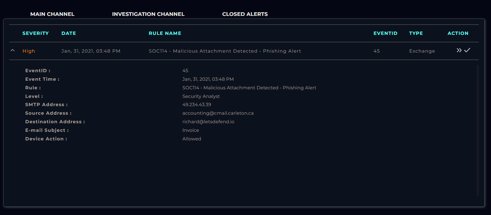

- Em ambientes SOC reais, a correta identificação do evento evita análises duplicadas ou incorretas, economizando tempo e reduzindo erros operacionais.

## Localização do Email na Plataforma

Utilizando o **endereço de origem** (`accounting@cmail.carleton.ca`) como critério de busca na aba **Email Security**, foi possível localizar rapidamente o evento correspondente ao **Event ID 45**, garantindo que a análise fosse conduzida sobre o incidente correto.

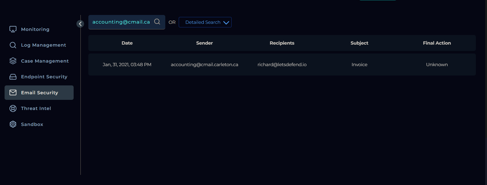

## Download do Arquivo Anexado

Ao acessar os detalhes do email, foi identificado um **arquivo anexado**, com o seguinte nome:

- **Nome do arquivo:** `c9ad9506bcccfaa987ff9fc11b91698d`
- **Senha do arquivo:** `infected`

> Importante: O download e a manipulação do arquivo foram realizados exclusivamente em ambiente de laboratório controlado, conforme boas práticas de análise de malware, de forma alguma execute em sua máquina.
> 

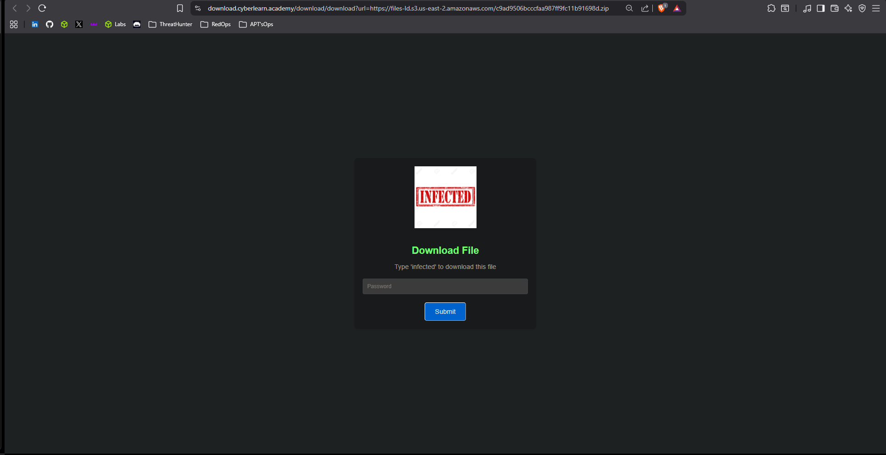

Ao clicar “submit”, o sistema redireciona para uma página de download protegida por senha. Após inserir a senha **“infected”**, o download do arquivo é liberado.

Esse comportamento, uso de arquivos compactados protegidos por senha, é uma técnica comum para **evitar detecção por mecanismos de segurança**, como gateways de email e antivírus.

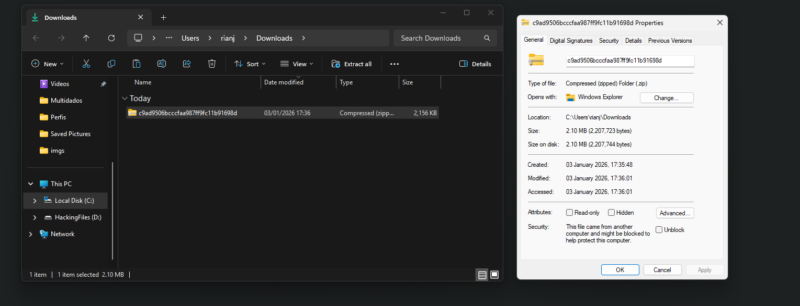

## Análise Inicial do Arquivo

Após o download, o sistema operacional exibiu um alerta indicando que o arquivo poderia ser malicioso, reforçando a necessidade de análise cuidadosa.

Ao verificar as **propriedades do arquivo**, foi possível confirmar que o arquivo estava no formato .zip e o tamanho era de aproximadamente 2,1 MB.

Essas características são compatíveis com anexos utilizados em campanhas de **malware delivery via phishing ou spear-phishing**, indicando a necessidade de prosseguir com uma análise mais aprofundada do conteúdo compactado.

Outra observação importante é que arquivos ZIP protegidos por senha são frequentemente utilizados para contornar inspeções automáticas e aumentar a taxa de sucesso de campanhas maliciosas.

## **Análise do Arquivo com Filescan.io**

Após a identificação e o download do arquivo compactado, o próximo passo foi realizar a análise do conteúdo utilizando a plataforma **Filescan.io**, uma ferramenta amplamente utilizada para **análise estática e dinâmica de arquivos suspeitos**.

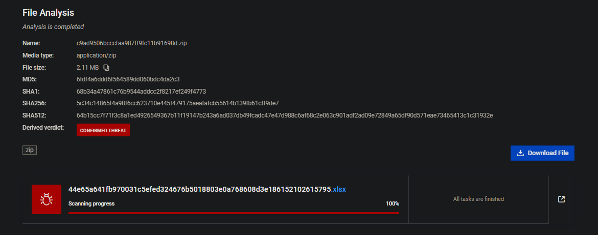

Durante a análise do arquivo compactado, foi identificado que ele continha um **documento Microsoft Excel (.xlsx)**, cujo **hash SHA-256** é:

- **SHA-256:**
    
    `44e65a641fb970031c5efed324676b5018803e0a768608d3e186152102615795`
    
- **Arquivo interno:**
    
    `44e65a641fb970031c5efed324676b5018803e0a768608d3e186152102615795.xlsx`
    

Esse arquivo foi automaticamente classificado pelo **Filescan.io** como **ameaça**, indicando a presença de **artefatos e comportamentos compatíveis com execução maliciosa**, conforme evidenciado por análise estática e emulação.

## Filescan.io – Overview

A escolha de um **documento Microsoft Office (Excel)** como vetor inicial de infecção reflete um padrão amplamente observado em campanhas de **phishing direcionadas**, nas quais o atacante explora a confiança do usuário final e funcionalidades legítimas da suíte Office para viabilizar a **execução de código no endpoint**. Esse método se alinha diretamente à técnica **Initial Access – Phishing: Attachment**, conforme definido no framework **MITRE ATT&CK (T1566.001)**, frequentemente empregada como estágio inicial em cadeias de **malware delivery** e observada tanto em campanhas oportunistas quanto em operações mais avançadas conduzidas por **grupos APT**.

Referência MITRE ATT&CK:

> [https://attack.mitre.org/techniques/T1566/001](https://attack.mitre.org/techniques/T1566/001/)
> 

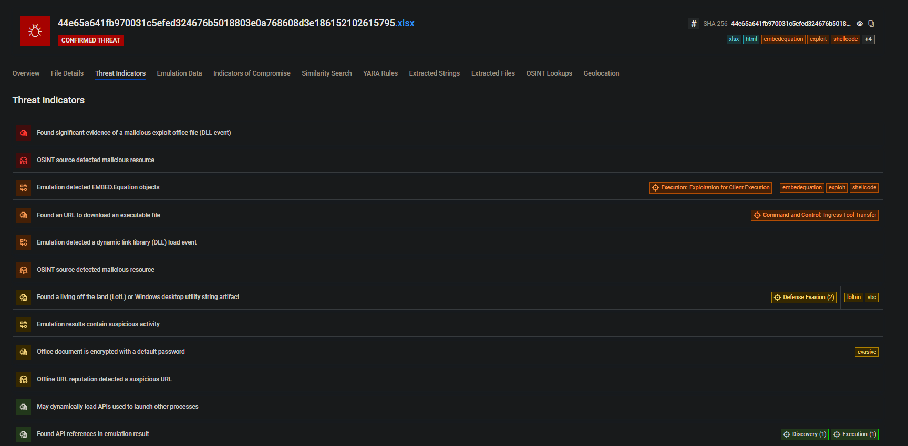

## Exploração via Documento Office

Foram identificadas **evidências significativas de exploração em arquivo Microsoft Office.**

A presença de objetos **EMBED.Equation** é um forte indicador de abuso do **Equation Editor**, técnica historicamente associada à exploração de vulnerabilidades em documentos Office para **execução de código arbitrário**. Esse comportamento está diretamente relacionado à técnica (**T1203**) no Mitre.

- 

Adicionalmente, a detecção de **eventos de carregamento de DLL** durante a emulação indica que o documento tenta **executar código adicional no sistema da vítima**, caracterizando um estágio inicial de execução.

Esses achados reforçam que o documento Excel não depende de macros VBA tradicionais, mas sim de **técnicas alternativas de execução**, aumentando sua eficácia contra controles de segurança baseados apenas em macro detection.

## **Download de Executável Externo e C2 (Command and Control)**

Durante a emulação do arquivo malicioso, foi identificado um **indicador crítico de Command and Control (C2)**, caracterizado pela tentativa de **download de um arquivo executável externo** a partir de infraestrutura remota controlada pelo atacante.
****

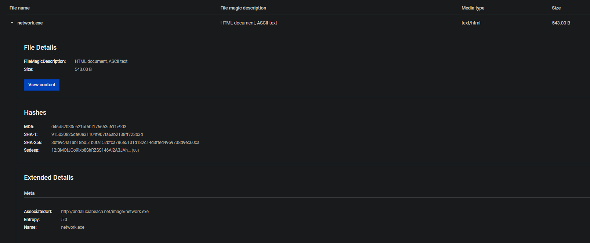

A URL identificada termina com a extensão **`.exe`**, indicando explicitamente a tentativa de obtenção de um **executável Windows**, comportamento típico de estágios posteriores à exploração inicial, nos quais o documento malicioso atua como **dropper**.

**URL associada:**

> http://andaluciabeach.net/image/network.exe
> 

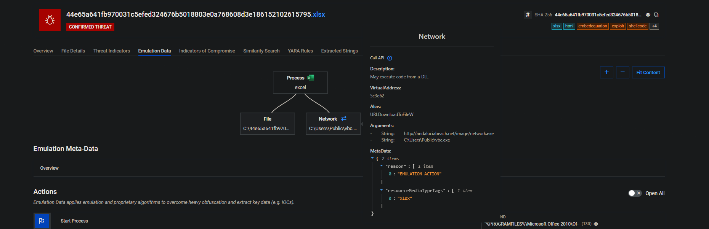

- **Program:** excel

**Command:**

```jsx
"%PROGRAMFILES%\Microsoft Office 2010\Office14\excel.exe" C:\44e65a641fb970031c5efed324676b5018803e0a768608d3e186152102615795.xlsx
```

Buscando no EndPoint Security na plataforma, podemos buscar pela url associada e veremos o resultado das buscas do c2, contendo o seguinte comandline: C:/Program Files/Microsoft Office/Office14/EXCEL.EXE.

Esse comandline é justamente usado para abrir o excel e executar o dropper.

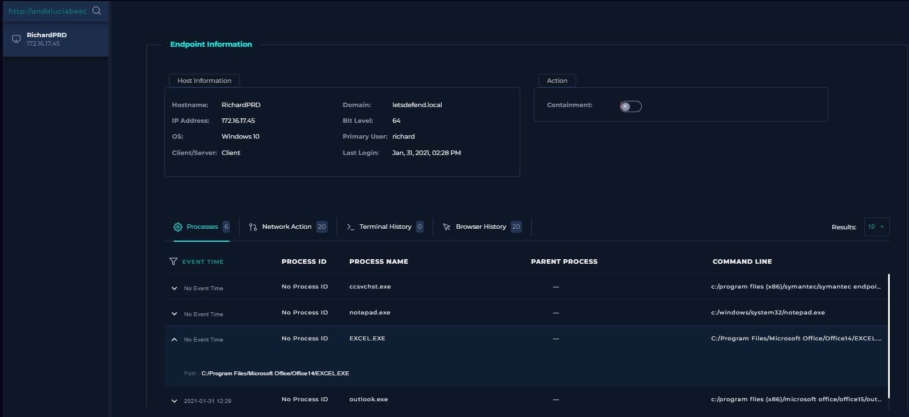

### **VirusTotal e Reconhecimento de Ameaça (Threat Intelligence)**

Com o objetivo de validar e enriquecer a análise, o arquivo compactado e seu conteúdo interno foram enviados ao **VirusTotal**, permitindo a correlação com **múltiplos motores antivírus**, **regras colaborativas (YARA/Sigma)** e **fontes OSINT**.

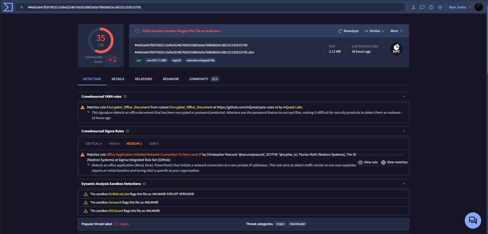

### Classificação Geral no VirusTotal

O arquivo foi amplamente reconhecido como malicioso:

- **Detecções:** **35/62** mecanismos de segurança
- **Classificação predominante:** **Trojan**
- **Arquivo analisado (SHA-256):**
    
    `44e65a641fb970031c5efed324676b5018803e0a768608d3e186152102615795`
    
- **Nome do arquivo:**
    
    `44e65a641fb970031c5efed324676b5018803e0a768608d3e186152102615795.xlsx`
    

Esse nível de detecção indica **consenso significativo entre vendors**, reduzindo drasticamente a probabilidade de falso positivo e reforçando a natureza maliciosa da amostra.

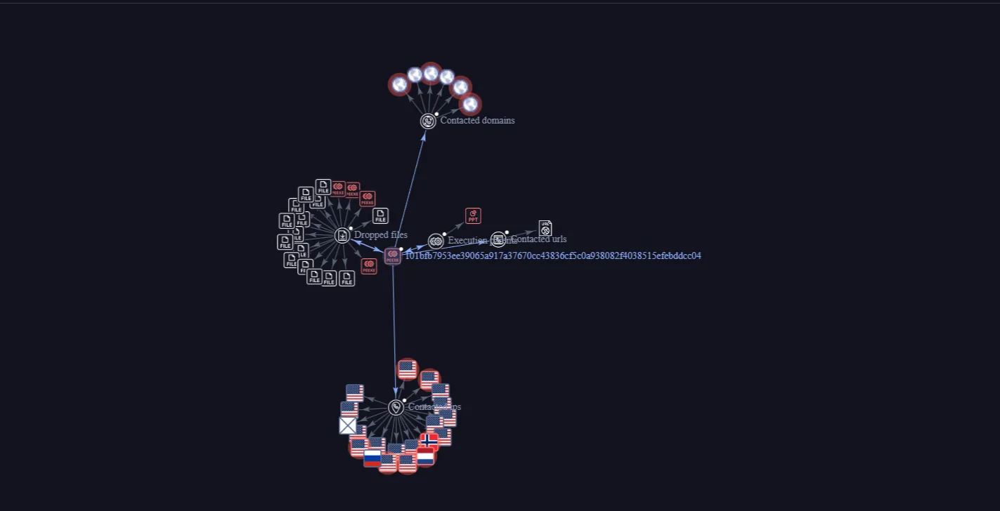

## Correlação com Filescan.io

Os resultados do VirusTotal corroboram diretamente os achados do **Filescan.io**, que classificou a amostra como:

- **Verdict:** **MALICIOUS**
- **Confidence:** **100/100**

### Tags relevantes identificadas:

- `embedequation`
- `exploit`
- `shellcode`
- `lolbin`
- `vbc`
- `ooxml`

# Finalização do Case – LetsDefend

Ao iniciar o laboratório **“SOC114 – Malicious Attachment Detected – Phishing Alert”**, as seguintes perguntas foram apresentadas como parte do processo de investigação do incidente:

- **When was it sent?**
    
    Jan 31, 2021 – 03:48 PM
    
- **What is the email's SMTP address?**
    
    `49.234.43.39`
    
- **What is the sender address?**
    
    `accounting@cmail.carleton.ca`
    
- **What is the recipient address?**
    
    `richard@letsdefend.io`
    
- **Is the mail content suspicious?**
    
    Yes
    
- **Are there any attachments?**
    
    Yes
    

Com base em toda a análise realizada ao longo deste walkthrough, incluindo a investigação do email, do anexo malicioso, da infraestrutura associada e da correlação com fontes OSINT, foi possível responder corretamente a **todas as questões propostas pelo laboratório**, validando a classificação do incidente como **phishing com anexo malicioso**.

Este material teve como objetivo demonstrar o **raciocínio analítico**, o **fluxo de investigação** e as **boas práticas de um Security Operations Center (SOC)**, ao invés de apenas apresentar as respostas finais.

Espero que este passo a passo tenha auxiliado na resolução do desafio. As respostas não foram explicitamente destacadas para incentivar a prática, a exploração dos artefatos e o desenvolvimento de diferentes linhas de pensamento durante a análise do incidente.

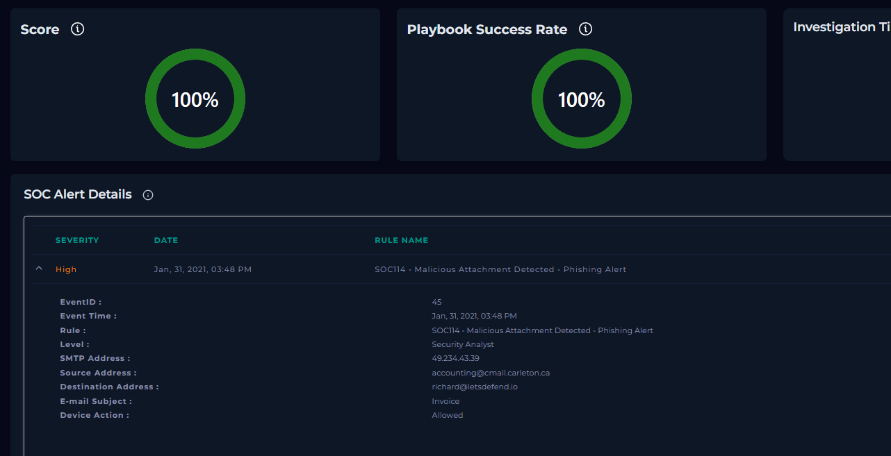

## Resumo do Caso

Neste walkthrough foi realizada a análise completa de um incidente de **phishing com anexo malicioso**, identificado no laboratório **“SOC114 – Malicious Attachment Detected – Phishing Alert”** da plataforma **LetsDefend**. A investigação seguiu o fluxo típico de um **Security Operations Center (SOC)**, partindo da identificação do alerta até a validação técnica da ameaça.

Ao longo da análise, foi possível confirmar que o email analisado continha um **arquivo compactado protegido por senha**, cujo conteúdo interno era um **documento Microsoft Excel malicioso**, projetado para explorar funcionalidades do Office e atuar como **dropper** para estágios posteriores da infecção.

A correlação entre:

- análise estática e emulação comportamental (Filescan.io),
- reputação e detecção por múltiplos vendors (VirusTotal),
- regras colaborativas (YARA e Sigma),
- e infraestrutura externa associada,

permitiu classificar o incidente com **alto grau de confiança** como um caso de **phishing com entrega de malware**, envolvendo técnicas de **Initial Access, Execution, Defense Evasion e Command and Control**, conforme o framework **MITRE ATT&CK**.

Este case demonstra a importância de uma abordagem analítica estruturada, baseada em evidências técnicas, e reforça como anexos Office continuam sendo um vetor amplamente explorado em campanhas maliciosas.

## Mapeamento de TTPs – MITRE ATT&CK

Com base na análise do email, do anexo malicioso, da emulação comportamental e da infraestrutura associada, foi possível identificar as seguintes **Táticas, Técnicas e Procedimentos (TTPs)** conforme o framework **MITRE ATT&CK**:

### **Initial Access**

**T1566.001 – Phishing: Attachment**

O vetor inicial do ataque foi um **email de phishing contendo um anexo malicioso**, disfarçado como documento legítimo. O uso de um arquivo Office protegido por senha reforça a tentativa de evasão de mecanismos de detecção.

---

### **Execution**

**T1204.002 – User Execution: Malicious File**

A execução da cadeia maliciosa depende da **interação do usuário**, que precisa abrir o arquivo Excel anexado.

**T1059.005 – Command and Scripting Interpreter: Visual Basic**

A emulação indicou o uso de **VBA/VBC** para execução de código, evidenciado por strings e eventos relacionados a scripts Visual Basic.

**T1106 – Native API**

O arquivo faz uso de **APIs nativas do Windows** para execução de processos e carregamento dinâmico de bibliotecas, conforme observado nos resultados de emulação.

---

### **Defense Evasion**

**T1027 – Obfuscated/Encrypted File or Information**

O documento Office encontra-se **criptografado/protegido por senha**, técnica amplamente utilizada para dificultar inspeção por soluções de segurança.

**T1218 – Signed Binary Proxy Execution (LoLBins)**

Foram identificados indícios de **Living-off-the-Land Binaries (LoLBins)**, utilizando utilitários legítimos do sistema operacional para execução indireta de código malicioso.

---

### **Command and Control**

**T1105 – Ingress Tool Transfer**

Durante a emulação, foi identificado o download de um **payload adicional** a partir da URL externa:

> http://andaluciabeach.net/image/network.exe
> 

Essa técnica indica a transferência de ferramentas a partir de infraestrutura controlada pelo atacante para dentro do ambiente comprometido.

**T1071.001 – Application Layer Protocol: Web Protocols (HTTP)**

A comunicação observada utiliza **HTTP**, caracterizando tráfego de C2 sobre protocolos web comuns.

---

### **Discovery**

**T1082 – System Information Discovery** *(indício)*

Chamadas de API e comportamentos genéricos observados durante a emulação sugerem possíveis ações iniciais de reconhecimento do sistema, comuns após a execução inicial do payload.

---

# Recomendações de Remediação

### Yara Rules

```jsx
rule autogen_xlsx_EmbedequationEvasiveExploitLolbinShellcodeVbc_44e65a64
{
	meta:
		author = "FileScan.IO Engine v1.1.0-634de8c"
		date = "2026-01-03"
		sample = "44e65a641fb970031c5efed324676b5018803e0a768608d3e186152102615795"
		score = 100
		tags = "embedequation,evasive,exploit,lolbin,shellcode,vbc"
		isWeakRule = true

	strings:
		$magicBytes = {D0 CF 11 E0 A1 B1 1A E1}

		//IOC patterns
		$req0 = "{FF9A3F03-56EF-4613-BDD5-5A41C1D07246}N"

		//optional strings
		$opt0 = "EncryptedPackage"
		$opt1 = "EncryptionInfo"
		$opt2 = "Microsoft Enhanced RSA and AES Cryptographic Provider"
		$opt3 = "StrongEncryptionDataSpace"
		$opt4 = "StrongEncryptionTransform"

	condition:
		//require 75% of optional strings
		$magicBytes at 0 and filesize > 1996647 and filesize < 2440345 and all of ($req*) and 3 of ($opt*)
}

```

## **Indicators of Compromise (IOCs)**

Os Indicadores de Comprometimento (IOCs) são extraídos do binário analisado ou de dados derivados da análise (por exemplo, arquivos extraídos). Indicadores com alta probabilidade de representarem um IOC real são marcados como **interessante**.

**Urls** 

| **IOC** | **Prevalence** | **OSINT** | **Verdict** |
| --- | --- | --- | --- |
| http://andaluciabeach.net/image/network.exe | [1](https://www.filescan.io/search-result?query=aHR0cDovL2FuZGFsdWNpYWJlYWNoLm5ldC9pbWFnZS9uZXR3b3JrLmV4ZQ%3D%3D&exclude=12bf808d-fc81-41b1-b266-ab782f6f76ec&age=7)[1](https://www.filescan.io/search-result?query=aHR0cDovL2FuZGFsdWNpYWJlYWNoLm5ldC9pbWFnZS9uZXR3b3JrLmV4ZQ%3D%3D&exclude=12bf808d-fc81-41b1-b266-ab782f6f76ec&verdict_groups=malicious%2Clikely_malicious&age=7) | **CL** | Compromised |
| **Origin:** VBA emulation |  |  |  |

**Domains**

| **IOC** | **Prevalence** | **Verdict** |
| --- | --- | --- |
| andaluciabeach.net | [1](https://www.filescan.io/search-result?domain=andaluciabeach.net&exclude=12bf808d-fc81-41b1-b266-ab782f6f76ec&age=7)[1](https://www.filescan.io/search-result?domain=andaluciabeach.net&exclude=12bf808d-fc81-41b1-b266-ab782f6f76ec&verdict_groups=malicious%2Clikely_malicious&age=7) | Compromised |
| **Origin:** VBA emulation |  |  |

**IPs**

| **IOC** | **Location** | **For domain** | **Prevalence** | **OSINT** | **Verdict** |
| --- | --- | --- | --- | --- | --- |
| 70.38.21.234 | - | resolução de DNS | [1](https://www.filescan.io/search-result?query=NzAuMzguMjEuMjM0&exclude=12bf808d-fc81-41b1-b266-ab782f6f76ec&age=7)[1](https://www.filescan.io/search-result?query=NzAuMzguMjEuMjM0&exclude=12bf808d-fc81-41b1-b266-ab782f6f76ec&verdict_groups=malicious%2Clikely_malicious&age=7) | **U** | Compromised |
| **Origin:** Domain resolve |  |  |  |  |  |
| andaluciabeach.net | [Canada, Montreal](https://www.filescan.io/#0) | - | [1](https://www.filescan.io/search-result?query=YW5kYWx1Y2lhYmVhY2gubmV0&exclude=12bf808d-fc81-41b1-b266-ab782f6f76ec&age=7)[1](https://www.filescan.io/search-result?query=YW5kYWx1Y2lhYmVhY2gubmV0&exclude=12bf808d-fc81-41b1-b266-ab782f6f76ec&verdict_groups=malicious%2Clikely_malicious&age=7) |  | Compromised |
| **Origin:** VBA emulation |  |  |  |  |  |

**MD5**

| 59f49d53c17e600ddb0d713ca0394372 | [1](https://www.filescan.io/search-result?query=NTlmNDlkNTNjMTdlNjAwZGRiMGQ3MTNjYTAzOTQzNzI%3D&exclude=12bf808d-fc81-41b1-b266-ab782f6f76ec&age=7)[1](https://www.filescan.io/search-result?query=NTlmNDlkNTNjMTdlNjAwZGRiMGQ3MTNjYTAzOTQzNzI%3D&exclude=12bf808d-fc81-41b1-b266-ab782f6f76ec&verdict_groups=malicious%2Clikely_malicious&age=7) | Compromised |
| --- | --- | --- |
| **Origin:** VBA emulation |  |  |
| 39519ab341387a816870ac9bfa4fc5de | [1](https://www.filescan.io/search-result?query=Mzk1MTlhYjM0MTM4N2E4MTY4NzBhYzliZmE0ZmM1ZGU%3D&exclude=12bf808d-fc81-41b1-b266-ab782f6f76ec&age=7)[1](https://www.filescan.io/search-result?query=Mzk1MTlhYjM0MTM4N2E4MTY4NzBhYzliZmE0ZmM1ZGU%3D&exclude=12bf808d-fc81-41b1-b266-ab782f6f76ec&verdict_groups=malicious%2Clikely_malicious&age=7) | Compromised |
| 3eb758fd53cd227f6736fd7108166e2d | [1](https://www.filescan.io/search-result?query=M2ViNzU4ZmQ1M2NkMjI3ZjY3MzZmZDcxMDgxNjZlMmQ%3D&exclude=12bf808d-fc81-41b1-b266-ab782f6f76ec&age=7)[1](https://www.filescan.io/search-result?query=M2ViNzU4ZmQ1M2NkMjI3ZjY3MzZmZDcxMDgxNjZlMmQ%3D&exclude=12bf808d-fc81-41b1-b266-ab782f6f76ec&verdict_groups=malicious%2Clikely_malicious&age=7) | Compromised |

**SHA1**

| **IOC** | **Prevalence** | **Verdict** |
| --- | --- | --- |
| f31fcc280c08ff4b52f98fa0ad39a41b8bf55fd7 | [1](https://www.filescan.io/search-result?query=ZjMxZmNjMjgwYzA4ZmY0YjUyZjk4ZmEwYWQzOWE0MWI4YmY1NWZkNw%3D%3D&exclude=12bf808d-fc81-41b1-b266-ab782f6f76ec&age=7)[1](https://www.filescan.io/search-result?query=ZjMxZmNjMjgwYzA4ZmY0YjUyZjk4ZmEwYWQzOWE0MWI4YmY1NWZkNw%3D%3D&exclude=12bf808d-fc81-41b1-b266-ab782f6f76ec&verdict_groups=malicious%2Clikely_malicious&age=7) | Compromised |
| **Origin:** VBA emulation |  |  |
| 015fc813fe78118f3aa73978abe78eb893f9b4df | [1](https://www.filescan.io/search-result?query=MDE1ZmM4MTNmZTc4MTE4ZjNhYTczOTc4YWJlNzhlYjg5M2Y5YjRkZg%3D%3D&exclude=12bf808d-fc81-41b1-b266-ab782f6f76ec&age=7)[1](https://www.filescan.io/search-result?query=MDE1ZmM4MTNmZTc4MTE4ZjNhYTczOTc4YWJlNzhlYjg5M2Y5YjRkZg%3D%3D&exclude=12bf808d-fc81-41b1-b266-ab782f6f76ec&verdict_groups=malicious%2Clikely_malicious&age=7) | Compromised |
| d76c78f497c799ed072a061f53bb19f3a381f475 | [1](https://www.filescan.io/search-result?query=ZDc2Yzc4ZjQ5N2M3OTllZDA3MmEwNjFmNTNiYjE5ZjNhMzgxZjQ3NQ%3D%3D&exclude=12bf808d-fc81-41b1-b266-ab782f6f76ec&age=7)[1](https://www.filescan.io/search-result?query=ZDc2Yzc4ZjQ5N2M3OTllZDA3MmEwNjFmNTNiYjE5ZjNhMzgxZjQ3NQ%3D%3D&exclude=12bf808d-fc81-41b1-b266-ab782f6f76ec&verdict_groups=malicious%2Clikely_malicious&age=7) | Compromised |

**SHA-256**

| **IOC** | **Prevalence** | **Verdict** |
| --- | --- | --- |
| 678012ef01aa26aea36b3326cea32e1ec7e3c6072bd7a68fe4b5ec8453cd8bbd | [1](https://www.filescan.io/search-result?query=Njc4MDEyZWYwMWFhMjZhZWEzNmIzMzI2Y2VhMzJlMWVjN2UzYzYwNzJiZDdhNjhmZTRiNWVjODQ1M2NkOGJiZA%3D%3D&exclude=12bf808d-fc81-41b1-b266-ab782f6f76ec&age=7)[1](https://www.filescan.io/search-result?query=Njc4MDEyZWYwMWFhMjZhZWEzNmIzMzI2Y2VhMzJlMWVjN2UzYzYwNzJiZDdhNjhmZTRiNWVjODQ1M2NkOGJiZA%3D%3D&exclude=12bf808d-fc81-41b1-b266-ab782f6f76ec&verdict_groups=malicious%2Clikely_malicious&age=7) | Compromised |
| **Origin:** VBA emulation |  |  |
| 56b1edecc9a282a9faafd95d4d9844608b1ae5ccc8731f34f8b30b3825734974 | [1](https://www.filescan.io/search-result?query=NTZiMWVkZWNjOWEyODJhOWZhYWZkOTVkNGQ5ODQ0NjA4YjFhZTVjY2M4NzMxZjM0ZjhiMzBiMzgyNTczNDk3NA%3D%3D&exclude=12bf808d-fc81-41b1-b266-ab782f6f76ec&age=7)[1](https://www.filescan.io/search-result?query=NTZiMWVkZWNjOWEyODJhOWZhYWZkOTVkNGQ5ODQ0NjA4YjFhZTVjY2M4NzMxZjM0ZjhiMzBiMzgyNTczNDk3NA%3D%3D&exclude=12bf808d-fc81-41b1-b266-ab782f6f76ec&verdict_groups=malicious%2Clikely_malicious&age=7) | Compromised |
| 9dc437b0afac437902c55cb4c3b12298f8e46bfc052b171c079f91c92f17b6e5 | [1](https://www.filescan.io/search-result?query=OWRjNDM3YjBhZmFjNDM3OTAyYzU1Y2I0YzNiMTIyOThmOGU0NmJmYzA1MmIxNzFjMDc5ZjkxYzkyZjE3YjZlNQ%3D%3D&exclude=12bf808d-fc81-41b1-b266-ab782f6f76ec&age=7)[1](https://www.filescan.io/search-result?query=OWRjNDM3YjBhZmFjNDM3OTAyYzU1Y2I0YzNiMTIyOThmOGU0NmJmYzA1MmIxNzFjMDc5ZjkxYzkyZjE3YjZlNQ%3D%3D&exclude=12bf808d-fc81-41b1-b266-ab782f6f76ec&verdict_groups=malicious%2Clikely_malicious&age=7) | Compromised |

**UUIDs**

| **IOC** | **Prevalence** | **Verdict** |
| --- | --- | --- |
| FF9A3F03-56EF-4613-BDD5-5A41C1D07246 | [1](https://www.filescan.io/search-result?uuid=FF9A3F03-56EF-4613-BDD5-5A41C1D07246&exclude=12bf808d-fc81-41b1-b266-ab782f6f76ec&age=7)[1](https://www.filescan.io/search-result?uuid=FF9A3F03-56EF-4613-BDD5-5A41C1D07246&exclude=12bf808d-fc81-41b1-b266-ab782f6f76ec&verdict_groups=malicious%2Clikely_malicious&age=7) | Compromised |
| **Origin:** Input file |  |  |
| 0002CE02-0000-0000-C000-000000000046 | [6](https://www.filescan.io/search-result?uuid=0002CE02-0000-0000-C000-000000000046&exclude=12bf808d-fc81-41b1-b266-ab782f6f76ec&age=7)[6](https://www.filescan.io/search-result?uuid=0002CE02-0000-0000-C000-000000000046&exclude=12bf808d-fc81-41b1-b266-ab782f6f76ec&verdict_groups=malicious%2Clikely_malicious&age=7) | Compromised |
| **Origin:** VBA emulation |  |  |

## Research

- links: [https://www.virustotal.com/graph/g99455b19762447ff8f9e2c2345f3981bcef55a575a1a49eeb92f7a99536dda25](https://www.virustotal.com/graph/g99455b19762447ff8f9e2c2345f3981bcef55a575a1a49eeb92f7a99536dda25)
- [https://www.virustotal.com/gui/file/44e65a641fb970031c5efed324676b5018803e0a768608d3e186152102615795/detection](https://www.virustotal.com/gui/file/44e65a641fb970031c5efed324676b5018803e0a768608d3e186152102615795/detection)
- [https://attack.mitre.org/techniques/T1566/001/](https://attack.mitre.org/techniques/T1566/001/)
- [https://www.filescan.io/uploads/6959879c8d1aa9829e29c8dd/reports/12bf808d-fc81-41b1-b266-ab782f6f76ec/overview](https://www.filescan.io/uploads/6959879c8d1aa9829e29c8dd/reports/12bf808d-fc81-41b1-b266-ab782f6f76ec/overview)